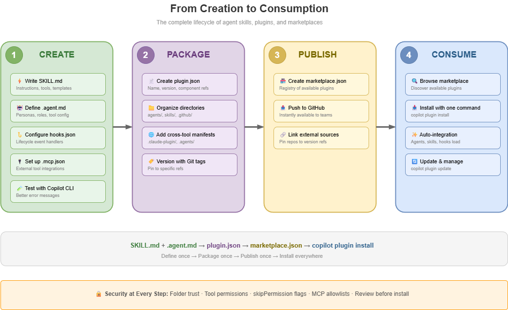

<!-- _footer: 'https://github.com/codebytes/agent-skills' -->
<!-- _paginate: skip -->

# <!-- fit --> Agent Skills, Plugins & Marketplace

## <!-- fit --> Extending GitHub Copilot with Reusable AI Capabilities

<!-- This talk covers the new extensibility model for GitHub Copilot: agent skills for teaching Copilot specialized tasks, plugins for packaging and distributing those capabilities, and marketplaces for discovering and sharing them across teams. -->

---


## Chris Ayers

### Principal Software Engineer<br>Azure CXP AzRel<br>Microsoft

<i class="fa-brands fa-bluesky"></i> BlueSky: [@chris-ayers.com](https://bsky.app/profile/chris-ayers.com)
<i class="fa-brands fa-linkedin"></i> LinkedIn: - [chris\-l\-ayers](https://linkedin.com/in/chris-l-ayers/)
<i class="fa fa-window-maximize"></i> Blog: [https://chris-ayers\.com/](https://chris-ayers.com/)
<i class="fa-brands fa-github"></i> GitHub: [Codebytes](https://github.com/codebytes)
<i class="fa-brands fa-mastodon"></i> Mastodon: [@Chrisayers@hachyderm.io](https://hachyderm.io/@Chrisayers)
~~<i class="fa-brands fa-twitter"></i> Twitter: @Chris_L_Ayers~~

---

<!-- _class: lead -->

# Agenda

<div class="agenda-list">
  <div><strong>Agent Skills</strong><span>Teaching Copilot specialized tasks</span></div>
  <div><strong>Plugins</strong><span>Packaging agents, skills, hooks & tools</span></div>
  <div><strong>Marketplaces</strong><span>Publishing, installing & managing plugins</span></div>
  <div><strong>Demo</strong><span>Building the <code>document-tools</code> plugin</span></div>
  <div><strong>Best Practices</strong><span>Security, versioning & team guidance</span></div>
</div>

<!-- Walk through each concept, then do a live demo building a plugin and publishing it to a marketplace. -->

---

<!-- _class: lead invert -->

# Agent Skills

---

## The Extensibility Stack

<div class="ecosystem-flow">
  <div class="ecosystem-stage skills">
    <i class="fa-solid fa-bolt"></i>
    <strong>Skills</strong>
    <span>On-demand capabilities</span>
    <code>SKILL.md</code>
  </div>
  <div class="ecosystem-stage agents">
    <i class="fa-solid fa-robot"></i>
    <strong>Agents</strong>
    <span>Specialized personas</span>
    <code>*.agent.md</code>
  </div>
  <div class="ecosystem-stage plugins">
    <i class="fa-solid fa-cube"></i>
    <strong>Plugins</strong>
    <span>Installable packages</span>
    <code>plugin.json</code>
  </div>
  <div class="ecosystem-stage marketplaces">
    <i class="fa-solid fa-store"></i>
    <strong>Marketplaces</strong>
    <span>Discovery & distribution</span>
    <code>marketplace.json</code>
  </div>
</div>

<!-- This stack previews the talk's progression: skills provide reusable capabilities, agents add specialization, plugins package components, and marketplaces distribute them. We will revisit the same model as an end-to-end lifecycle near the close. -->

---

## What Are Agent Skills?

Skills are **folders** containing instructions, scripts, and resources that Copilot **automatically loads** when relevant to your prompt.

- Defined with a `SKILL.md` file
- Discovered from supported project, personal, or package locations
- Work across **GitHub Copilot surfaces** and other compatible agents
- Can include scripts, templates, and reference files

<!-- Agent skills were announced for Copilot in December 2025 and are now supported across Copilot's cloud agent, code review, CLI, app, and IDE agent modes. The key insight is demand loading: the host reads metadata first, then loads the full instructions only when relevant. -->

---

## Skill Directory Structure

```
csv-analysis/
├── SKILL.md              # Metadata + instructions
├── scripts/
│   └── analyze.py        # Optional executable code
├── references/
│   └── schema.md         # Optional supporting docs
└── assets/
    └── report.md         # Optional templates/resources
```

- `SKILL.md` is the entry point — **required**
- Supporting files are referenced from the instructions
- Put the folder under a supported discovery or package location

<!-- This is the directory shape standardized by agentskills.io. The standard defines the contents of a skill, not a universal installation path. Supporting scripts, references, and assets give the skill concrete capabilities beyond prompting. -->

---

## Anatomy of a SKILL.md

```markdown
---
name: csv-analysis
description: Analyze CSV files and generate reports. Use when asked to profile or assess CSV data.
license: MIT
---

## Instructions

When asked to analyze a CSV file:
1. Inspect the header and representative rows
2. Run `scripts/analyze.py` to compute statistics
3. Generate a report using `assets/report.md`

## Output Format

Always include: row count, column types, 
summary statistics, and any anomalies found.
```

<!-- The portable specification requires name and description. License, compatibility, metadata, and the experimental allowed-tools field are optional. The body contains the workflow the agent follows. -->

---

## How Skills Are Discovered


Skills load **on demand** — only when Copilot determines they match the task.

<!-- This is important for performance. You can have dozens of skills defined, but Copilot only loads the ones relevant to the current prompt. This keeps context windows clean and focused. -->

---

## Discovery Is Host-Specific

<!-- _class: small -->

| Pattern | Examples | Purpose |
|---------|----------|---------|
| Shared project convention | `.agents/skills/` | Portable project skills where supported |
| GitHub project locations | `.github/skills/`, `.claude/skills/` | Copilot repository skills |
| Host-specific locations | `.claude/skills/`, `.gemini/skills/` | Native host discovery |
| Personal locations | `~/.agents/skills/`, `~/.copilot/skills/` | Skills shared across projects |
| Installers and packages | `gh skill`, plugins, extensions | Put skills where each host expects |

**The standard defines the skill. The host defines discovery.**

<!-- agentskills.io standardizes the folder and SKILL.md format, but it does not require every host to scan the same path. Keep one canonical source and use an installer, package, generated adapter, or host-supported shared path instead of maintaining hand-copied skill bodies. -->

---

## Write Once, Adapt Per Host


**Portable format. Host-specific placement.**

<!-- The SKILL.md format is the portable layer. Keep one source, then let each host discover it through a supported path, installer, plugin, extension, or generated adapter. -->

---

## The Open Agent Skills Standard

The SKILL.md format is an **open standard** ([agentskills.io](https://agentskills.io)) shared across leading AI agent tools:

- ✅ **GitHub Copilot CLI** — Full plugin + marketplace support
- ✅ **VS Code** (Copilot agent mode) — Plugin support (preview)
- ✅ **Claude Code** — Full plugin + marketplace support
- ✅ **OpenAI Codex CLI** — Skills support, community registries
- ✅ **Gemini CLI** — Skills + extensions support

All share the same core `SKILL.md` format; discovery and packaging remain
host-specific.

<!-- The portable layer is the skill directory itself. Hosts may add metadata, permissions, packaging, and installation conventions, so test activation and tool behavior in every target host. -->

---

<!-- _class: lead invert -->

# Plugins

---

## What Are Plugins?

Plugins are **installable packages** that bundle Copilot customizations into a single distributable unit.

Think of it as **package management for your Copilot configurations**.

<!-- Before plugins, sharing Copilot customizations meant submodules, manual file copying, or trying to keep configurations in sync across repos. Plugins solve this with a proper packaging and distribution model. -->

---

## What's Inside a Plugin?


The demo uses an **agent + skill**; plugins can include any combination.

<!-- A plugin can be as small as one skill or as broad as a focused toolkit. The manifest ties together agents, skills, hooks, MCP servers, and LSP servers without requiring every plugin to include all five. -->

---

## The Plugin Manifest

```json
{
  "name": "document-tools",
  "description": "Data analysis demo plugin",
  "version": "1.0.0",
  "agents": "./agents/",
  "skills": "./skills/"
}
```

<!-- plugin.json lives in .github/ within the plugin directory. The name should only contain letters, numbers, and dashes. File paths are relative to the plugin root, not the .github directory. Author, license, keywords, hooks, MCP servers, and LSP servers can be added as needed. -->

---

## Plugin Manifest Differences

<div class="manifest-cards">
  <div class="manifest-card">
    <h3>Plugin manifests</h3>
    <p><strong>Copilot CLI + VS Code</strong><br><code>.github/plugin.json</code></p>
    <p><strong>Claude Code</strong><br><code>.claude-plugin/plugin.json</code></p>
  </div>
  <div class="manifest-card">
    <h3>Native host models</h3>
    <p><strong>Codex CLI</strong><br>Skill installers and repositories</p>
    <p><strong>Gemini CLI</strong><br>Extensions and registries</p>
  </div>
</div>

<p class="manifest-takeaway"><strong>Keep one skill implementation;</strong> add only the host adapters you support.</p>

<!-- Copilot and Claude use similar plugin concepts but different manifest locations and host capabilities. Both manifests in this repository point to the same plugin-local skill. Codex and Gemini use their own installation and extension models rather than a Copilot plugin manifest. -->

---

## Plugins vs Manual Configuration

<div class="columns">
<div>

### Manual Config

- Scoped to **single repository**
- Sharing via **copy/paste**
- Versioned through **git history**
- Discovery by **searching repos**

</div>
<div>

### Plugins

- Works across **any project**
- Install with **one command**
- **Marketplace versioning**
- **Browsable** marketplace registry

</div>
</div>

<!-- The key advantage is reusability and consistency. Define once, install everywhere. No more drift between team members running different versions of the same configuration. -->

---

<!-- _class: lead invert -->

# Marketplaces

---

## What Is a Marketplace?

A **marketplace** is a Git repository that serves as a **registry** for available plugins.

- Contains a `marketplace.json` manifest
- Lists plugins with metadata and source locations
- Acts as a lightweight **app store** for plugins

<!-- Think of it like npm registry, but for Copilot plugins. A marketplace is just a Git repo with a specific JSON file that describes what plugins are available and where to find them. -->

---

## Default Marketplaces

Two marketplaces are registered **by default** — no setup needed:

| Marketplace | Description |
|-------------|-------------|
| **[copilot-plugins](https://github.com/github/copilot-plugins)** | Official GitHub Copilot plugins |
| **[awesome-copilot](https://github.com/github/awesome-copilot)** | Community-contributed plugins |

Additional community resources:
- [anthropic/skills](https://github.com/anthropics/skills) — Reference skills (Anthropic)
- [DevsForge Marketplace](https://github.com/claudeforge/marketplace) — Community plugins

<!-- Both VS Code and Copilot CLI ship with these two marketplaces pre-configured. You can start browsing and installing plugins immediately without any setup. -->

---

## Creating a Marketplace

```json
// .github/plugin/marketplace.json
{
  "name": "my-team-plugins",
  "owner": { "name": "My Team" },
  "plugins": [
    {
      "name": "document-tools",
      "description": "Data analysis demo plugin",
      "version": "1.0.0",
      "source": "./plugins/document-tools"
    }
  ]
}
```

<!-- The marketplace.json file goes in .github/plugin/ at the root of a Git repository. Each plugin entry points to a directory containing the plugin manifest. Optional marketplace metadata can add a description and version. Push to GitHub and you have a working marketplace. -->

---

## Marketplace Architecture


<!-- A single marketplace repository can host multiple plugins, each with their own combination of components. Plugins can also reference external repositories for versioned sources. -->

---

## Versioning with External Sources

Plugins can reference **external repositories** with specific versions:

```json
{
  "plugins": [
    {
      "name": "external-tool",
      "description": "Tool from another repo",
      "version": "2.0.0",
      "source": {
        "source": "url",
        "url": "https://github.com/org/tool-plugin",
        "ref": "v2.0"
      }
    }
  ]
}
```

<!-- This allows your marketplace to curate plugins from multiple repositories, each pinned to a specific tag or branch. Great for enterprise teams that want to control which versions are available. -->

---

## Install and Manage from Copilot CLI

```bash
# Browse marketplaces
copilot plugin marketplace list
copilot plugin marketplace browse awesome-copilot

# Install plugins
copilot plugin install document-tools@agent-skills
copilot plugin install user/repo
copilot plugin install user/repo:plugins/subfolder

# Manage plugins
copilot plugin list
copilot plugin update document-tools
copilot plugin uninstall document-tools

# Add custom marketplace
copilot plugin marketplace add my-org/internal-plugins
```

<!-- Copilot CLI provides the most detailed error messages when something goes wrong. Ken Muse recommends starting with CLI before VS Code for troubleshooting. -->

---

## VS Code Integration

1. Enable: Set `chat.plugins.enabled` to `true`
2. Add marketplaces in settings:

```json
{
  "chat.plugins.marketplaces": [
    "my-org/my-plugins"
  ]
}
```

3. Browse: Extensions view → search `@agentPlugins`
4. Or: Command Palette → **Chat: Plugins**

<!-- VS Code must have plugins enabled as a preview feature. Marketplace configurations must be set at the user level — workspace settings won't work. The @agentPlugins search filter in Extensions view shows all available plugins from your registered marketplaces. -->

---

## How Plugins Work at Runtime

Install once; agents, skills, hooks, and tools join the **Copilot session**.


<!-- After installation, agents appear in agent selection, skills load when relevant, hooks fire at lifecycle events, and MCP servers extend the available tools. The package handles integration that would otherwise require manual configuration. -->

---

## Where Plugins Are Stored

| Source | Location |
|--------|----------|
| Marketplace plugins | `~/.copilot/installed-plugins/MARKETPLACE/PLUGIN/` |
| Direct installs | `~/.copilot/installed-plugins/_direct/PLUGIN/` |
| VS Code (macOS) | `~/Library/Application Support/Code/agentPlugins/` |
| VS Code (Windows) | `%APPDATA%/Code/agentPlugins/` |

<!-- Knowing where plugins are stored helps with debugging. If a plugin isn't loading, check these paths to verify it was installed correctly. -->

---

<!-- _class: lead invert -->

# Demo: Building a Plugin

---

## Step 1: Create the Plugin Structure

```bash
mkdir -p plugins/document-tools/.github
mkdir -p plugins/document-tools/.claude-plugin
mkdir -p plugins/document-tools/{agents,skills/csv-analysis}
```

```
plugins/document-tools/
├── .github/plugin.json
├── .claude-plugin/plugin.json
├── agents/data-analyst.agent.md
└── skills/csv-analysis/SKILL.md
```

<!-- Build the same document-tools plugin that is checked into this repository. The Copilot and Claude manifests package one shared agent and skill implementation. Hooks and server configurations can be added later without changing the basic structure. -->

---

<!-- _class: small -->

## Step 2: Write the Plugin Manifests

```json
// plugins/document-tools/.github/plugin.json
{
  "name": "document-tools",
  "description": "Data analysis demo plugin",
  "version": "1.0.0",
  "author": { "name": "Your Team" },
  "license": "MIT",
  "keywords": ["data", "analysis", "csv"],
  "agents": ["./agents/data-analyst.agent.md"],
  "skills": ["./skills/csv-analysis/"]
}
```

> Claude Code: add `.claude-plugin/plugin.json` for the same package.

<!-- The name now stays document-tools through every remaining demo step. Component paths are resolved from the plugin root, even though the Copilot manifest lives under .github. The Claude manifest exposes the same underlying agent and skill. -->

---

## Step 3: Create an Agent

```markdown
<!-- agents/data-analyst.agent.md -->
---
name: data-analyst
description: Expert data analyst for CSV, JSON, and SQL data
---

You are an expert data analyst. When given data files:

1. Identify the format (CSV, JSON, SQL dump)
2. Profile the data (row counts, column types, nulls)
3. Generate summary statistics
4. Flag anomalies or quality issues
5. Produce a clean, formatted report
```

<!-- The agent markdown file defines a persona and workflow. When users invoke this agent, Copilot adopts the specialized role and follows these instructions. -->

---

## Step 4: Create a Skill

```markdown
<!-- skills/csv-analysis/SKILL.md -->
---
name: csv-analysis
description: Analyze CSV files and generate statistical reports. Use when asked to profile or assess CSV data.
license: MIT
---

## Instructions

When asked to analyze a CSV file:
1. Read the file and identify columns
2. Compute summary statistics per column
3. Detect missing values and outliers
4. Generate a markdown report with tables

## Output

Include: row count, column types, min/max/mean,
null counts, and any detected anomalies.
```

<!-- This is the same csv-analysis skill introduced earlier, now packaged inside the document-tools plugin. Skills are more focused than agents: they define a capability rather than a persona and load on demand when relevant. -->

---

## Step 5: Publish as a Marketplace

```json
// .github/plugin/marketplace.json
{
  "name": "agent-skills",
  "owner": { "name": "Chris Ayers" },
  "metadata": { "version": "1.0.0" },
  "plugins": [
    {
      "name": "document-tools",
      "description": "Data analysis toolkit",
      "version": "1.0.0",
      "source": "./plugins/document-tools"
    }
  ]
}
```

Push to GitHub → teammates can install immediately!

<!-- That's it. Push the repo to GitHub, and anyone can add your marketplace and install your plugins. The source field points to the plugin directory relative to the repo root. -->

---

## Step 6: Install & Use

```bash
# Add the marketplace
copilot plugin marketplace add codebytes/agent-skills

# Browse available plugins
copilot plugin marketplace browse agent-skills

# Install the plugin
copilot plugin install document-tools@agent-skills

# Verify installation
copilot plugin list
```

Now the agent and skills are available in **every project**!

<!-- Once installed, the data-analyst agent appears in agent selection and the csv-analysis skill auto-loads whenever a user works with CSV files. No per-project configuration needed. -->

---

<!-- _class: lead invert -->

# Best Practices

---

## Plugin Security Model

- **Folder trust** — Confirm a repository before hooks can load
- **Tool permissions** — Keep approvals narrow and intentional
- **MCP allowlists** — Restrict which servers a plugin may connect
- **Review before install** — Use `skipPermission` only for audited safe operations


<!-- Security begins before installation: inspect the source and confirm folder trust. At runtime, standard tool approvals and MCP allowlists constrain access. Pre-approval mechanisms such as skipPermission should be limited to reviewed, low-risk operations. -->

---

## Tips for Teams

- **Start with marketplace plugins** before building your own
- **Keep plugins focused** — one domain per plugin
- **Use plugins for team standards** — ensure consistency
- **Test with Copilot CLI first** — better error messages than VS Code
- **Pin and version sources** — use tags or immutable `ref` values
- **Review and update deliberately** — plugins can run code on your machine

<!-- The most common mistake is making plugins too broad. A "Rails development" plugin is better than an "everything" plugin. Focused plugins are easier to maintain and compose. -->

---

<!-- _class: small -->

## Known Limitations (Preview)

| Issue | Detail |
|-------|--------|
| **VS Code settings** | Marketplaces must be user-level, not workspace |
| **Dev containers** | Plugin install may not work in containers |
| **Silent failures** | Manifest errors cause feeds to not appear |
| **Aggressive caching** | VS Code caches feed details; may need reload |
| **Branch installs** | CLI doesn't yet support branch-based install |

> **Tip:** Use VS Code Insiders for the latest fixes. Use Copilot CLI for debugging plugin issues.

<!-- These are preview-era limitations that will improve. The most frustrating is silent failures — if your marketplace.json has a typo, the feed simply won't appear with no error message. Always validate with Copilot CLI first. -->

---

## The Full Lifecycle: Create → Consume



<!-- The opening stack showed how the concepts layer together. This closing view turns those same layers into a lifecycle: create capabilities, package them, publish them, then install and use them. Security and review apply at every step. -->

---

<div class="columns">
<div>

## Links

- **[GitHub Docs](https://docs.github.com/en/copilot/concepts/agents/copilot-cli/about-cli-plugins)** — CLI plugins
- **[awesome-copilot](https://github.com/github/awesome-copilot)** — Community examples
- **[copilot-plugins](https://github.com/github/copilot-plugins)** — Official registry
- **[Ken Muse](https://www.kenmuse.com/blog/creating-agent-plugins-for-vs-code-and-copilot-cli/)** — Plugin walkthrough
- **[agentskills.io](https://agentskills.io)** — Open standard
- **[Codebytes Skills](https://chris-ayers.com/skills/)** — Reusable catalog

</div>
<div>

## Chris Ayers

<i class="fa-brands fa-bluesky"></i> BlueSky: [@chris-ayers.com](https://bsky.app/profile/chris-ayers.com)
<i class="fa-brands fa-linkedin"></i> LinkedIn: - [chris\-l\-ayers](https://linkedin.com/in/chris-l-ayers/)
<i class="fa fa-window-maximize"></i> Blog: [https://chris-ayers\.com/](https://chris-ayers.com/)
<i class="fa-brands fa-github"></i> GitHub: [Codebytes](https://github.com/codebytes)
<i class="fa-brands fa-mastodon"></i> Mastodon: [@Chrisayers@hachyderm.io](https://hachyderm.io/@Chrisayers)

</div>
</div>

<!-- All the references used for this presentation. The Ken Muse blog post is especially good for a step-by-step walkthrough of creating a plugin from an existing skills repository. -->

---

<!-- _class: lead -->

# <!-- fit --> Questions?


